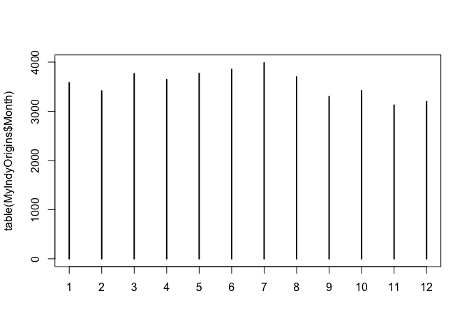
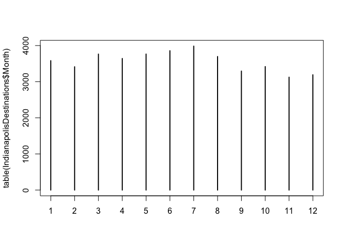
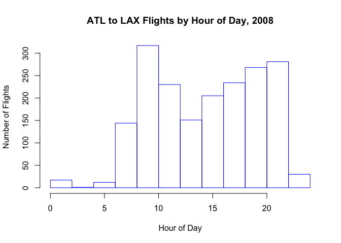

Introduction to R for Data Science (FutureLearn) - Week 1
================

By Graeme West

This notebook covers the material in Week 1 of [Introduction to R for
Data Science](https://www.futurelearn.com/courses/data-science/5) by
Purdue University on FutureLearn.

The subject matter of the data is airline flight data from the United
States. Week 1 covers basic setup, exploratory data analysis, selecting
data, and basic plotting.

## Step 1.12

Read in the basic 2008 data (this takes a couple of minutes):

``` r
myDF <- read.csv("./datasets/2008.csv.bz2")
```

Phew, that was tough\! Let’s try and make heads and tails of
    it…

``` r
head(myDF)
```

    ##   Year Month DayofMonth DayOfWeek DepTime CRSDepTime ArrTime CRSArrTime
    ## 1 2008     1          3         4    2003       1955    2211       2225
    ## 2 2008     1          3         4     754        735    1002       1000
    ## 3 2008     1          3         4     628        620     804        750
    ## 4 2008     1          3         4     926        930    1054       1100
    ## 5 2008     1          3         4    1829       1755    1959       1925
    ## 6 2008     1          3         4    1940       1915    2121       2110
    ##   UniqueCarrier FlightNum TailNum ActualElapsedTime CRSElapsedTime AirTime
    ## 1            WN       335  N712SW               128            150     116
    ## 2            WN      3231  N772SW               128            145     113
    ## 3            WN       448  N428WN                96             90      76
    ## 4            WN      1746  N612SW                88             90      78
    ## 5            WN      3920  N464WN                90             90      77
    ## 6            WN       378  N726SW               101            115      87
    ##   ArrDelay DepDelay Origin Dest Distance TaxiIn TaxiOut Cancelled
    ## 1      -14        8    IAD  TPA      810      4       8         0
    ## 2        2       19    IAD  TPA      810      5      10         0
    ## 3       14        8    IND  BWI      515      3      17         0
    ## 4       -6       -4    IND  BWI      515      3       7         0
    ## 5       34       34    IND  BWI      515      3      10         0
    ## 6       11       25    IND  JAX      688      4      10         0
    ##   CancellationCode Diverted CarrierDelay WeatherDelay NASDelay
    ## 1                         0           NA           NA       NA
    ## 2                         0           NA           NA       NA
    ## 3                         0           NA           NA       NA
    ## 4                         0           NA           NA       NA
    ## 5                         0            2            0        0
    ## 6                         0           NA           NA       NA
    ##   SecurityDelay LateAircraftDelay
    ## 1            NA                NA
    ## 2            NA                NA
    ## 3            NA                NA
    ## 4            NA                NA
    ## 5             0                32
    ## 6            NA                NA

``` r
tail(myDF)
```

    ##         Year Month DayofMonth DayOfWeek DepTime CRSDepTime ArrTime
    ## 7009723 2008    12         13         6     749        750     901
    ## 7009724 2008    12         13         6    1002        959    1204
    ## 7009725 2008    12         13         6     834        835    1021
    ## 7009726 2008    12         13         6     655        700     856
    ## 7009727 2008    12         13         6    1251       1240    1446
    ## 7009728 2008    12         13         6    1110       1103    1413
    ##         CRSArrTime UniqueCarrier FlightNum TailNum ActualElapsedTime
    ## 7009723        859            DL      1636  N646DL                72
    ## 7009724       1150            DL      1636  N646DL               122
    ## 7009725       1023            DL      1637  N908DL               167
    ## 7009726        856            DL      1638  N671DN               121
    ## 7009727       1437            DL      1639  N646DL               115
    ## 7009728       1418            DL      1641  N908DL               123
    ##         CRSElapsedTime AirTime ArrDelay DepDelay Origin Dest Distance
    ## 7009723             69      41        2       -1    SAV  ATL      215
    ## 7009724            111      71       14        3    ATL  IAD      533
    ## 7009725            168     139       -2       -1    ATL  SAT      874
    ## 7009726            116      85        0       -5    PBI  ATL      545
    ## 7009727            117      89        9       11    IAD  ATL      533
    ## 7009728            135     104       -5        7    SAT  ATL      874
    ##         TaxiIn TaxiOut Cancelled CancellationCode Diverted CarrierDelay
    ## 7009723     20      11         0                         0           NA
    ## 7009724      6      45         0                         0           NA
    ## 7009725      5      23         0                         0           NA
    ## 7009726     24      12         0                         0           NA
    ## 7009727     13      13         0                         0           NA
    ## 7009728      8      11         0                         0           NA
    ##         WeatherDelay NASDelay SecurityDelay LateAircraftDelay
    ## 7009723           NA       NA            NA                NA
    ## 7009724           NA       NA            NA                NA
    ## 7009725           NA       NA            NA                NA
    ## 7009726           NA       NA            NA                NA
    ## 7009727           NA       NA            NA                NA
    ## 7009728           NA       NA            NA                NA

## Step 1.13: Looking at only Indianapolis flights

First let’s look at the top of the ‘Origin’ column.

``` r
head(myDF$Origin)
```

    ## [1] IAD IAD IND IND IND IND
    ## 303 Levels: ABE ABI ABQ ABY ACK ACT ACV ACY ADK ADQ AEX AGS AKN ALB ... YUM

And the tail:

``` r
tail(myDF$Origin)
```

    ## [1] SAV ATL ATL PBI IAD SAT
    ## 303 Levels: ABE ABI ABQ ABY ACK ACT ACV ACY ADK ADQ AEX AGS AKN ALB ... YUM

Let’s also check the ‘dest’ column:

``` r
head(myDF$Dest)
```

    ## [1] TPA TPA BWI BWI BWI JAX
    ## 304 Levels: ABE ABI ABQ ABY ACK ACT ACV ACY ADK ADQ AEX AGS AKN ALB ... YUM

``` r
tail(myDF$Dest)
```

    ## [1] ATL IAD SAT ATL ATL ATL
    ## 304 Levels: ABE ABI ABQ ABY ACK ACT ACV ACY ADK ADQ AEX AGS AKN ALB ... YUM

## Step 1.15: Identifying Properties

Let’s slice by origin to identify flights that began in Indianapolis:

``` r
head(myDF$Origin == "IND")
```

    ## [1] FALSE FALSE  TRUE  TRUE  TRUE  TRUE

Okay, so that returned a series of Booleans. Let’s get the total number
by doing a ‘sum’:

``` r
sum(myDF$Origin == "IND")
```

    ## [1] 42750

Let’s count the flights that were destined to Indianapolis:

``` r
sum(myDF$Dest == "IND")
```

    ## [1] 42732

## Step 1.17: Extracting Flight Data with a Common City of Origin

Make a new DataFrame with the entries from the total data where the
origin airport was Indianapolis:

``` r
MyIndyOrigins <- subset(myDF, myDF$Origin == "IND")
head(MyIndyOrigins)
```

    ##   Year Month DayofMonth DayOfWeek DepTime CRSDepTime ArrTime CRSArrTime
    ## 3 2008     1          3         4     628        620     804        750
    ## 4 2008     1          3         4     926        930    1054       1100
    ## 5 2008     1          3         4    1829       1755    1959       1925
    ## 6 2008     1          3         4    1940       1915    2121       2110
    ## 7 2008     1          3         4    1937       1830    2037       1940
    ## 8 2008     1          3         4    1039       1040    1132       1150
    ##   UniqueCarrier FlightNum TailNum ActualElapsedTime CRSElapsedTime AirTime
    ## 3            WN       448  N428WN                96             90      76
    ## 4            WN      1746  N612SW                88             90      78
    ## 5            WN      3920  N464WN                90             90      77
    ## 6            WN       378  N726SW               101            115      87
    ## 7            WN       509  N763SW               240            250     230
    ## 8            WN       535  N428WN               233            250     219
    ##   ArrDelay DepDelay Origin Dest Distance TaxiIn TaxiOut Cancelled
    ## 3       14        8    IND  BWI      515      3      17         0
    ## 4       -6       -4    IND  BWI      515      3       7         0
    ## 5       34       34    IND  BWI      515      3      10         0
    ## 6       11       25    IND  JAX      688      4      10         0
    ## 7       57       67    IND  LAS     1591      3       7         0
    ## 8      -18       -1    IND  LAS     1591      7       7         0
    ##   CancellationCode Diverted CarrierDelay WeatherDelay NASDelay
    ## 3                         0           NA           NA       NA
    ## 4                         0           NA           NA       NA
    ## 5                         0            2            0        0
    ## 6                         0           NA           NA       NA
    ## 7                         0           10            0        0
    ## 8                         0           NA           NA       NA
    ##   SecurityDelay LateAircraftDelay
    ## 3            NA                NA
    ## 4            NA                NA
    ## 5             0                32
    ## 6            NA                NA
    ## 7             0                47
    ## 8            NA                NA

Let’s do the same for the flights that were destined for Indianapolis:

``` r
IndianapolisDestinations <- subset(myDF, myDF$Dest == "IND")
head(IndianapolisDestinations)
```

    ##     Year Month DayofMonth DayOfWeek DepTime CRSDepTime ArrTime CRSArrTime
    ## 72  2008     1          3         4     802        750    1001        955
    ## 136 2008     1          3         4    2255       1820     509         55
    ## 137 2008     1          3         4    1129       1050    1757       1725
    ## 501 2008     1          3         4    1038       1010    1259       1230
    ## 502 2008     1          3         4    1920       1850    2140       2110
    ## 605 2008     1          3         4    1139       1140    1401       1405
    ##     UniqueCarrier FlightNum TailNum ActualElapsedTime CRSElapsedTime
    ## 72             WN      2272  N263WN               119            125
    ## 136            WN      1924  N761RR               194            215
    ## 137            WN      3920  N464WN               208            215
    ## 501            WN         4  N674AA                81             80
    ## 502            WN       321  N742SW                80             80
    ## 605            WN       829  N476WN               142            145
    ##     AirTime ArrDelay DepDelay Origin Dest Distance TaxiIn TaxiOut
    ## 72      104        6       12    JAX  IND      688      7       8
    ## 136     176      254      275    LAS  IND     1591      9       9
    ## 137     179       32       39    LAS  IND     1591      8      21
    ## 501      63       29       28    MCI  IND      451      8      10
    ## 502      61       30       30    MCI  IND      451      9      10
    ## 605     123       -4       -1    MCO  IND      828      8      11
    ##     Cancelled CancellationCode Diverted CarrierDelay WeatherDelay NASDelay
    ## 72          0                         0           NA           NA       NA
    ## 136         0                         0            0            0        0
    ## 137         0                         0           32            0        0
    ## 501         0                         0            3            0        1
    ## 502         0                         0           30            0        0
    ## 605         0                         0           NA           NA       NA
    ##     SecurityDelay LateAircraftDelay
    ## 72             NA                NA
    ## 136             8               246
    ## 137             0                 0
    ## 501             0                25
    ## 502             0                 0
    ## 605            NA                NA

How would we determine which flights departed in a particular month?
We’ll try a table first.

``` r
table(MyIndyOrigins$Month)
```

    ## 
    ##    1    2    3    4    5    6    7    8    9   10   11   12 
    ## 3580 3414 3764 3644 3768 3852 3986 3700 3300 3418 3126 3198

And now a table:

``` r
plot(table(MyIndyOrigins$Month))
```

<!-- -->

Now the same for destinations:

``` r
plot(table(IndianapolisDestinations$Month))
```

<!-- -->

## Step 1.19: Analyzing the Departure Times of Flights

Let’s look at the flights with departure times before 6AM:

``` r
sum(MyIndyOrigins$DepTime < 600)
```

    ## [1] NA

This causes an issue because some value are NaNs. We’ll set the `na.rm`
parameter to drop these from the calculation:

``` r
sum(MyIndyOrigins$DepTime < 600, na.rm=TRUE)
```

    ## [1] 692

Let’s count the ‘NaN’ values in the `DepTime` column:

``` r
sum(is.na(MyIndyOrigins$DepTime))
```

    ## [1] 739

## Step 1.21 Annotating R Code with Comments

“Make a plot of departure times, grouped by hour, for the flights from
ATL to
LAX.”:

``` r
atllaxflights <- myDF[ which(myDF$Origin == "ATL" & myDF$Dest == "LAX"), ]
head(atllaxflights)
```

    ##        Year Month DayofMonth DayOfWeek DepTime CRSDepTime ArrTime
    ## 302878 2008     1         15         2    1337       1330    1523
    ## 302989 2008     1         15         2    2117       2120    2316
    ## 303102 2008     1         15         2     656        700     852
    ## 303478 2008     1         16         3      NA       1850      NA
    ## 303503 2008     1         16         3    1742       1735    2329
    ## 303521 2008     1         16         3      NA        835      NA
    ##        CRSArrTime UniqueCarrier FlightNum TailNum ActualElapsedTime
    ## 302878       1515            DL      1185  N129DL               286
    ## 302989       2325            DL      1423  N644DL               299
    ## 303102        851            DL      1556  N640DL               296
    ## 303478       2054            DL        41  N130DL                NA
    ## 303503       1932            DL        75   N6709               527
    ## 303521       1033            DL       110  N837MH                NA
    ##        CRSElapsedTime AirTime ArrDelay DepDelay Origin Dest Distance
    ## 302878            285     267        8        7    ATL  LAX     1946
    ## 302989            305     265       -9       -3    ATL  LAX     1946
    ## 303102            291     268        1       -4    ATL  LAX     1946
    ## 303478            304      NA       NA       NA    ATL  LAX     1946
    ## 303503            297     269      237        7    ATL  LAX     1946
    ## 303521            298      NA       NA       NA    ATL  LAX     1946
    ##        TaxiIn TaxiOut Cancelled CancellationCode Diverted CarrierDelay
    ## 302878      4      15         0                         0           NA
    ## 302989     14      20         0                         0           NA
    ## 303102      7      21         0                         0           NA
    ## 303478     NA      NA         1                A        0           NA
    ## 303503      7     251         0                         0            0
    ## 303521     NA      NA         1                B        0           NA
    ##        WeatherDelay NASDelay SecurityDelay LateAircraftDelay
    ## 302878           NA       NA            NA                NA
    ## 302989           NA       NA            NA                NA
    ## 303102           NA       NA            NA                NA
    ## 303478           NA       NA            NA                NA
    ## 303503            7      230             0                 0
    ## 303521           NA       NA            NA                NA

I noticed that there are several NA entries in the DepTime column for
this DataFrame. So let’s drop those, then group it by hour:

``` r
atllaxflights_clean <- na.omit(atllaxflights, cols="DepTime")
atllaxflights_clean$timestamp <- strptime(sprintf("%04d", atllaxflights_clean$DepTime), format="%H%M")
atllaxflights_clean$depHour <- as.numeric(format(atllaxflights_clean$timestamp, format="%H"))
head(atllaxflights_clean, 10)
```

    ##        Year Month DayofMonth DayOfWeek DepTime CRSDepTime ArrTime
    ## 303503 2008     1         16         3    1742       1735    2329
    ## 303863 2008     1         16         3    1505       1440    1705
    ## 304349 2008     1         16         3     712        700     907
    ## 304757 2008     1         17         4    1742       1735    1954
    ## 305126 2008     1         17         4    1533       1440    1725
    ## 305165 2008     1         17         4    1114       1100    1321
    ## 305385 2008     1         17         4    1356       1330    1547
    ## 305502 2008     1         17         4    2145       2120    2349
    ## 306087 2008     1         18         5    1658       1600    1850
    ## 307337 2008     1         19         6    2007       1850    2155
    ##        CRSArrTime UniqueCarrier FlightNum TailNum ActualElapsedTime
    ## 303503       1932            DL        75   N6709               527
    ## 303863       1631            DL       885  N831MH               300
    ## 304349        851            DL      1556  N702TW               295
    ## 304757       1932            DL        75   N6701               312
    ## 305126       1631            DL       885  N830MH               292
    ## 305165       1255            DL       937  N139DL               307
    ## 305385       1515            DL      1185  N144DA               291
    ## 305502       2325            DL      1423  N6704Z               304
    ## 306087       1756            DL       125  N6712B               292
    ## 307337       2054            DL        41  N124DE               288
    ##        CRSElapsedTime AirTime ArrDelay DepDelay Origin Dest Distance
    ## 303503            297     269      237        7    ATL  LAX     1946
    ## 303863            291     261       34       25    ATL  LAX     1946
    ## 304349            291     271       16       12    ATL  LAX     1946
    ## 304757            297     266       22        7    ATL  LAX     1946
    ## 305126            291     263       54       53    ATL  LAX     1946
    ## 305165            295     264       26       14    ATL  LAX     1946
    ## 305385            285     268       32       26    ATL  LAX     1946
    ## 305502            305     264       24       25    ATL  LAX     1946
    ## 306087            296     265       54       58    ATL  LAX     1946
    ## 307337            304     255       61       77    ATL  LAX     1946
    ##        TaxiIn TaxiOut Cancelled CancellationCode Diverted CarrierDelay
    ## 303503      7     251         0                         0            0
    ## 303863     10      29         0                         0           25
    ## 304349      8      16         0                         0           12
    ## 304757     14      32         0                         0            7
    ## 305126     11      18         0                         0           53
    ## 305165     14      29         0                         0           12
    ## 305385      4      19         0                         0            0
    ## 305502     15      25         0                         0            0
    ## 306087     14      13         0                         0           54
    ## 307337     13      20         0                         0           61
    ##        WeatherDelay NASDelay SecurityDelay LateAircraftDelay
    ## 303503            7      230             0                 0
    ## 303863            0        9             0                 0
    ## 304349            0        4             0                 0
    ## 304757            0       15             0                 0
    ## 305126            0        1             0                 0
    ## 305165            0       12             0                 2
    ## 305385            0        6             0                26
    ## 305502           24        0             0                 0
    ## 306087            0        0             0                 0
    ## 307337            0        0             0                 0
    ##                  timestamp depHour
    ## 303503 2019-03-13 17:42:00      17
    ## 303863 2019-03-13 15:05:00      15
    ## 304349 2019-03-13 07:12:00       7
    ## 304757 2019-03-13 17:42:00      17
    ## 305126 2019-03-13 15:33:00      15
    ## 305165 2019-03-13 11:14:00      11
    ## 305385 2019-03-13 13:56:00      13
    ## 305502 2019-03-13 21:45:00      21
    ## 306087 2019-03-13 16:58:00      16
    ## 307337 2019-03-13 20:07:00      20

Now, let’s generate a plot of these, grouped by
hour:

``` r
hist(atllaxflights_clean$depHour, main="ATL to LAX Flights by Hour of Day, 2008", xlab="Hour of Day", ylab="Number of Flights", border="blue")
```

<!-- -->
